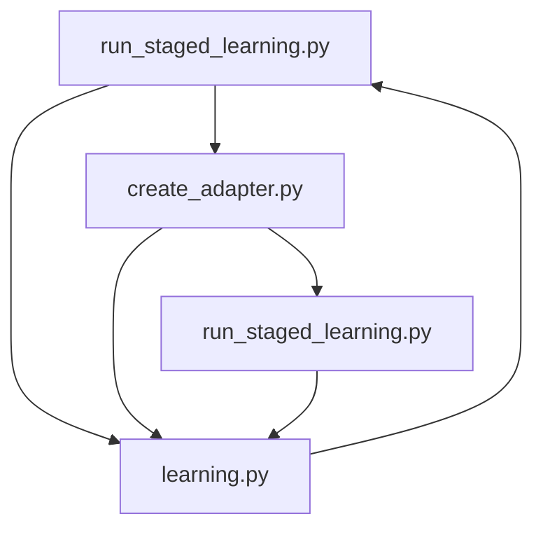

**STAGE LEARNING WORKFLOW**

We want to generate molecules given a prior (reinvent, libinvent, linkinvent, or mol2mol). This process can be subject to transfer learning, where, starting from a final model in the first stage of training, we want to introduce new scoring functions in a second stage (stage 1: final model → stage 2), focusing on a particular region of the chemical space. Another common practice is to select a checkpoint (.chkpt) from the best model (the model with the highest score) of a stage and continue to the second stage using this best model (stage 1: best model → stage 2).

This is the workflow followed by the stage learning environment in **REINVENT4**:|

